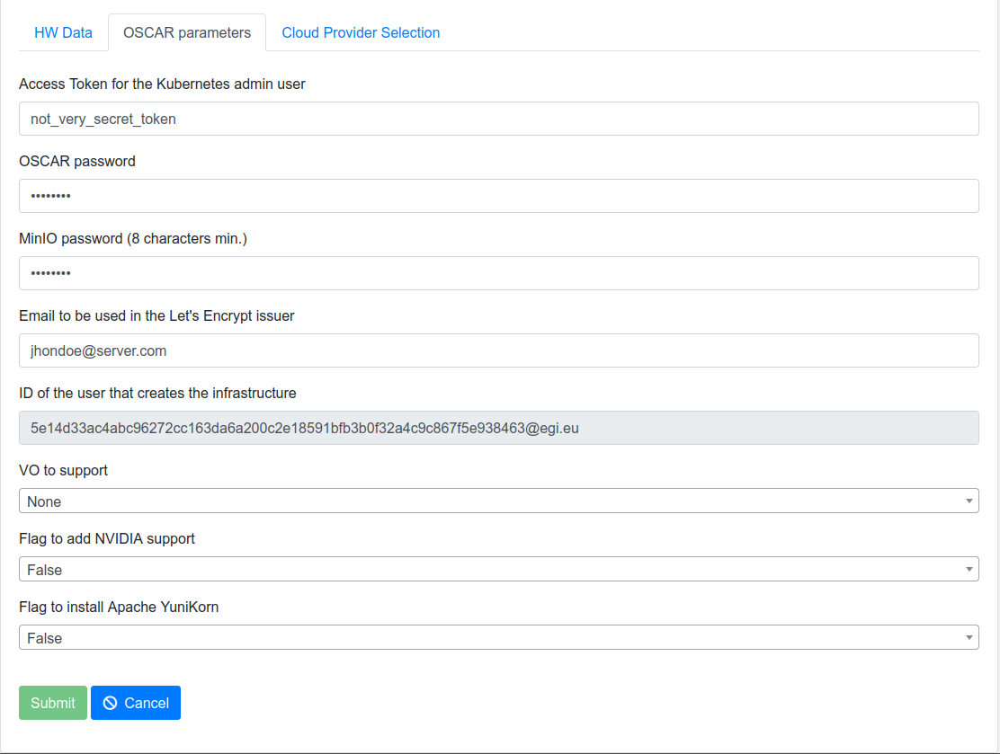
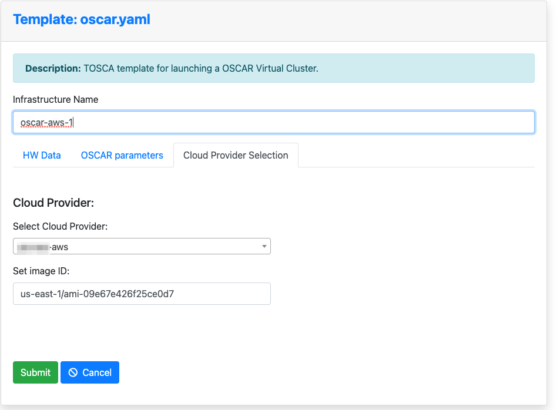
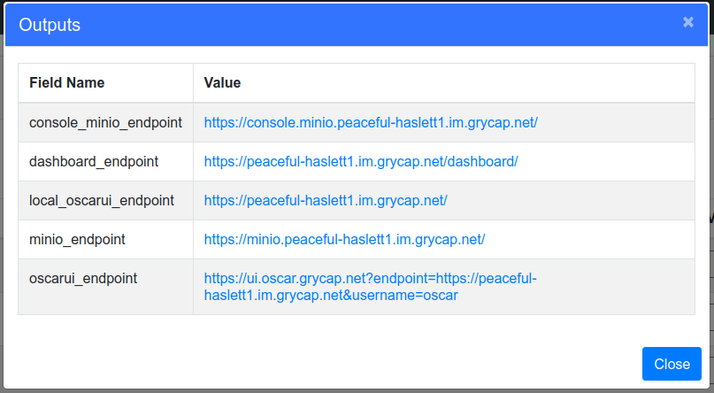
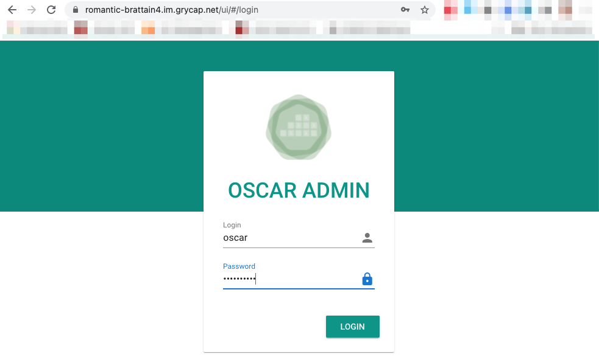
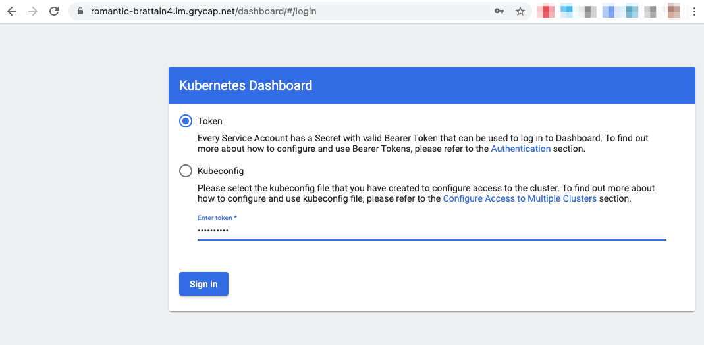

# Deployment with the IM Dashboard

An OSCAR cluster can be easily deployed on multiple Cloud back-ends without requiring any installation by using the [Infrastructure Manager](https://www.grycap.upv.es/im)'s Dashboard ([IM Dashboard](https://appsgrycap.i3m.upv.es:31443/im-dashboard/login)). This is a managed service provided by the [GRyCAP](https://www.grycap.upv.es) research group at the [Universitat Politècnica de València](https://www.upv.es) to deploy customized virtual infrastructures across many Cloud providers. 

Using the IM Dashboard is the easiest and most convenient approach to deploy an OSCAR cluster. It also automatically allocates a DNS entry and TLS certificates to support HTTPS-based access to the OSCAR cluster and companion services (e.g. MinIO).

This example shows how to deploy an OSCAR cluster on [Amazon Web Services (AWS)](https://aws.amazon.com) with two nodes. Thanks to the IM, the very same procedure applies to deploy the OSCAR cluster in an on-premises Cloud (such as OpenStack) or any other Cloud provider supported by the IM.

These are the steps:

1. Access the [IM Dashboard](https://appsgrycap.i3m.upv.es:31443/im-dashboard/login)

    

    You will need to authenticate via [EGI Check-In](https://www.egi.eu/services/check-in/), which supports mutiple Identity Providers (IdP). 

2. Configure the Cloud Credentials

    Once logged in, you need to define the access credentials to the Cloud on which the OSCAR cluster will be deployed. These should be temporary credentials under the [principle of least privilege (PoLP)](https://searchsecurity.techtarget.com/definition/principle-of-least-privilege-POLP).

    

    

    

    In our case we indicate an identifier for the set of credentials, [the Access Key ID and the Secret Access Key](https://docs.aws.amazon.com/general/latest/gr/aws-sec-cred-types.html) for an [IAM](https://aws.amazon.com/iam/) user that has privileges to deploy Virtual Machines in [Amazon EC2](https://aws.amazon.com/ec2). 

3. Select the OSCAR template

    

4. Customize and deploy the OSCAR cluster

    In this panel you can specify the number of Working Nodes (WNs) of the cluster together with the computational requirements for each node. We leave the default values.
    

    In this panel, specify the passwords to be employed to access the Kubernetes Web UI (Dashboard), to access the OSCAR web UI and to access the MinIO dashboard. These tokens can also be used for programmatic access to the respective services.
    

    Now, choose the Cloud provider. The ID specified when creating the Cloud credentials will be shown.
    You will also need to specify the [Amazon Machine Image (AMI) identifier](https://docs.aws.amazon.com/AWSEC2/latest/UserGuide/AMIs.html). We chose an AMI based on Ubuntu 20.04 provided by Canonical whose identifier for the us-east-1 region is: ami-09e67e426f25ce0d7

    NOTE: You should obtain the AMI identifier for the latest version of the OS. This way, security patches will be already installed. You can obtain this AMI identifier from the AWS Marketplace or the Amazon EC2 service. 

    

    Give the infrastructure a name and press "Submit".

5. Check the status of the deployment OSCAR cluster

    You will see that the OSCAR cluster is being deployed and the infrastructure reaches the status "running". The process will not finish until it reaches the state "configured".

    

    If you are interested in understanding what is happening under the hood you can see the logs:

    

6. Accessing the OSCAR cluster

    Once reached the "configured" state, see the "Outputs" to obtain the different endpoints:

    

    The OSCAR UI can be accessed with the username ``oscar`` and the password you specified at deployment time.

    

    The MinIO UI can be accessed with the username ``minio`` and the password you specified at deployment time.

    

    The Kubernetes Dashboard can be accessed with the token you specified at deployment time.
    

    You can obtain statistics about the Kubernetes cluster:
    

7. Terminating the OSCAR cluster

    You can terminate the OSCAR cluster from the IM Dashboard:
    