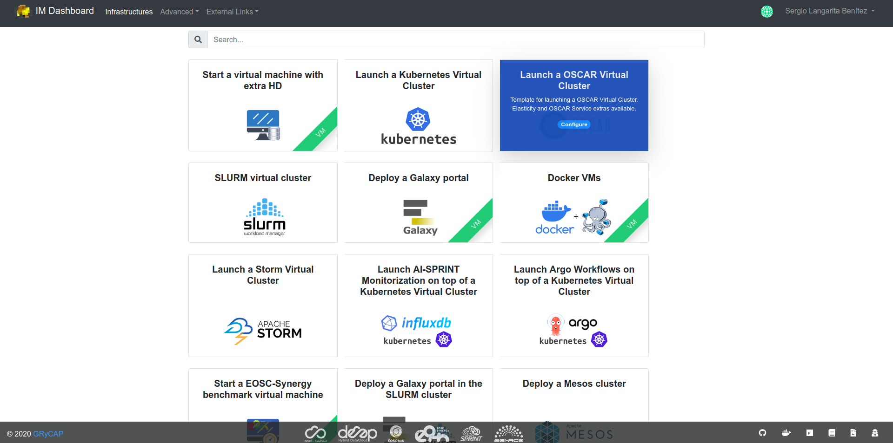
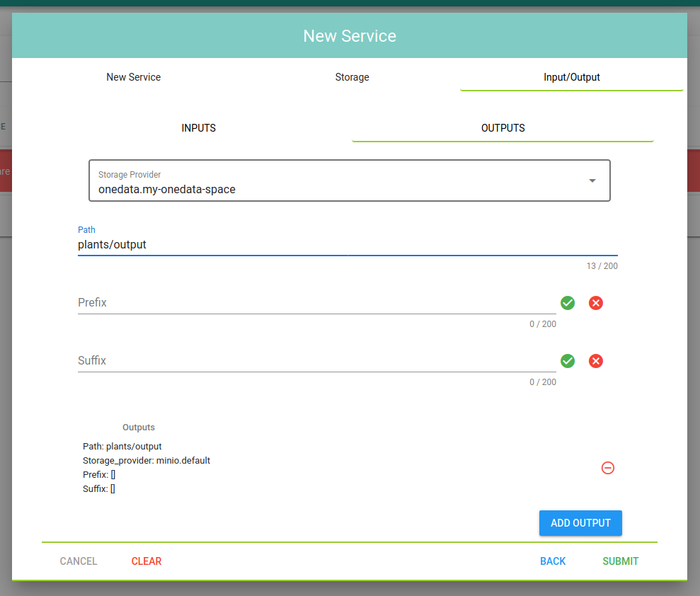

# Integration with the EGI Federated Cloud

[EGI](https://www.egi.eu/) is a federation of many cloud providers and hundreds of data centres, spread across Europe and worldwide that delivers advanced computing services to support scientists, multinational projects and research infrastructures.

The [EGI Federated Cloud](https://www.egi.eu/federation/egi-federated-cloud/) is an IaaS-type cloud, made of academic private clouds and virtualised resources and built around open standards. Its development is driven by requirements of the scientific communities.

## EGI Applications on Demand: IM Dashboard

The OSCAR platform can be deployed on the EGI Federated Cloud resources through the [IM Dashboard](https://appsgrycap.i3m.upv.es:31443/im-dashboard/) available in the [EGI Applications on Demand](https://marketplace.egi.eu/42-applications-on-demand) service.

The [IM Dashboard documentation](https://docs.egi.eu/users/compute/orchestration/im/dashboard/) can be followed in order to deploy the platform.

## EGI DataHub

[EGI DataHub](https://datahub.egi.eu/), based on [Onedata](https://onedata.org/#/home), provides a global data access solution for science. Integrated with the EGI AAI, it allows users to have Onedata spaces supported by providers across Europe for replicated storage and on-demand caching. 

EGI DataHub can be used as an output storage provider for OSCAR, allowing users to store the resulting files of their OSCAR services on a Onedata space. This can be done thanks to the [FaaS Supervisor](https://github.com/grycap/faas-supervisor). Used in OSCAR and [SCAR](https://github.com/grycap/scar), responsible for managing the data Input/Output and the user code execution.

To deploy a function with Onedata as output storage provider you only have to specify an identifier, the URL of the Oneprovider host, your access token and the name of your Onedata space in the "Storage" tab of the service creation wizard:

And the path where you want to store the files in the "OUTPUTS" tab:

This means that scientists can store their output files on their Onedata space in the EGI DataHub for long-time persistence and easy sharing of experimental results between researchers.