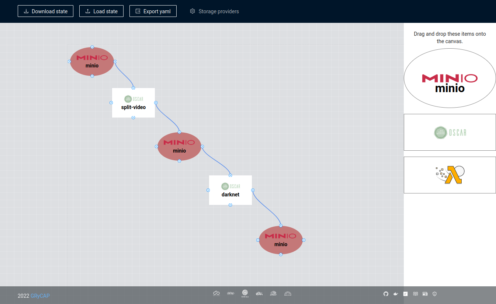

# Functions Definition Language Composer

Writing an entire workflow in plain text could be a tough task for many users.
To simplify the process you can use FDL Composer, a tool developed by
[GRyCAP](https://www.grycap.upv.es/) to facilitate the definition of FDL YAML
files for [OSCAR](https://oscar.grycap.net/) and
[SCAR](https://scar.readthedocs.io) platforms from a user-friendly interactive
graphic interface.



## How to access

It does not require installation, just access to
[FDL Composer web](https://composer.oscar.grycap.net/). If you prefer to
execute on your computer instead of using the web. Clone the git repository:

``` sh
git clone https://github.com/grycap/fdl-composer
```

Run the app with npm:

``` sh
npm start
```

## Basic elements

### OSCAR services

It requires filling at least the name, image, and script fields inputs. To
define environment variables you must add them as a comma separated string of
*key=value* entries. For example,  to create a variable with the name
`firstName` and the value `John`, the "Environment variables" field should
look like `firstName=John`. If you want to assign more than one variable, for
example, `firstName` and `lastName` with the values `John` and `Keats`, the
input field should fill with `firstName=John,lastName=Keats`.

### Storage providers and buckets/folders

Three types of storage providers can be used in OSCAR FDLs: MinIO, S3, and
OneData. First of all, they must be configured, to do it drag the storage
provider from the menu to the canvas and double click on the item created, a
window with a single input will appear. Then introduce the path of the folder
name. To edit one of the storage providers, move the mouse over the item and
select the edit option.
**Remember that only MinIO can be used as input storage provider for OSCAR services.**

### Download and load state

The graphic workflow can be saved in a file using the "Download state" button.
OSCAR services, Storage Providers, and Buckets are kept in the file. The
graphic workflow can be edited later by loading it with the "Load state" button.

### Create a YAML file

 You can easily download the workflow's YAML file through the "Export Yaml"
 button. In case of an error, a window will appear warning about it.

## Connecting components

All components have four ports, up and left ones are input ports and right and
down ports can be used as output. Services can only be connected with storage
providers, always linked in the same direction (the output of one element with
the input of the other). When two services are connected between them, both
will be declared in the YAML the file, but they will work separately, and
there will be no workflow between them. If two storage providers are connected
between them, it will have no effect, both storages will be declared.

## SCAR options

FDL Composer can also create FDL files for the SCAR tool. Using it, you can
define workflows that can be executed on the Edge or on On-premises Clouds
through OSCAR, and on the public Cloud (AWS Lambda and/or AWS Batch) through
SCAR.

## Example

There is an example of fdl-composer implementing the
[video-process](https://github.com/grycap/oscar/tree/master/examples/video-process)
use case in our [blog](https://oscar.grycap.net/blog/post-oscar-fdl-composer/).
