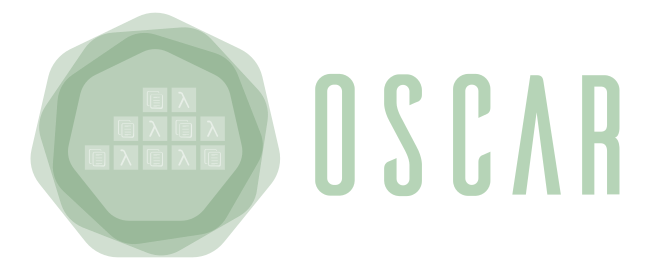

# Introduction

OSCAR is a framework to efficiently support on-premises FaaS (Functions as a
Service)for general-purpose file-processing computing applications.
It represents the porting to an on-premises scenario of the
[SCAR framework](https://github.com/grycap/scar), which supports a
[High Throughput Computing Programming Model](https://scar.readthedocs.io/en/latest/prog_model.html)
to create highly-parallel event-driven file-processing serverless applications
that execute on customized runtime environments provided by Docker containers
run on AWS Lambda.

## Goal

Users upload files to a bucket and this automatically triggers the execution
of parallel invocations to a function responsible for processing each file.
Output files are delivered into an output bucket for the convenience of the
user. Highly scalable HTTP-based endpoints can also be offered to expose a generic application. A user-provided shell script is executed inside
the container run from the user-defined Docker image to achieve the
right execution environment for the application.

## Components

OSCAR runs on an elastic [Kubernetes](http://kubernetes.io) cluster that is
deployed using:

- [EC3](http://www.grycap.upv.es/ec3), an open-source tool to deploy compute
    clusters that can horizontally scale in terms of the number of nodes with multiple
    plugins.
- [IM](http://www.grycap.upv.es/im), an open-source virtual infrastructure
    provisioning tool for multi-Clouds.
- [CLUES](http://github.com/grycap/clues), an elasticity manager that
    horizontally scales in and out the number of nodes of the Kubernetes
    cluster according to the workload.

The following components are deployed inside the Kubernetes cluster in order
to support the OSCAR platform:

- [MinIO](http://minio.io), a high performance distributed object storage
    server that provides an API compatible with S3.
- [Knative](https://knative.dev), a Serverless framework to serve
    container-based applications for synchronous invocations (default Serverless Backend).
- [OpenFaaS](https://www.openfaas.com/), a FaaS platform that allows creating
    functions executed via HTTP requests.
- OSCAR, the main application, responsible for the management of the services
    and the integration of the different components to support event-driven
    serverless computing for file processing. It includes a web-based GUI aimed
    at end users to facilitate interaction with OSCAR.

As external storage providers, the following services can be used:

- External [MinIO](https://min.io) servers, which may be in clusters other
    than the platform.
- [Amazon [S3](https://aws.amazon.com/s3/), AWS's object storage
    service that offers industry-leading scalability, data availability,
    security, and performance in the public Cloud.
- [Onedata](https://onedata.org/), the global data access solution for science
    used in the [EGI Federated Cloud](https://datahub.egi.eu/).
- Any storage provider that can be accessible through
    [WebDAV](http://www.webdav.org/) protocol. An example of a storage provider
    supporting this protocol is [dCache](https://dcache.org/), a storage
    middleware system capable of managing the storage and exchange of large data
    quantities.

***Note**: All of the mentioned storage providers can be used as output, but
only MinIO can be used as input.*
  
An OSCAR cluster can be accessed via its
[REST API](https://grycap.github.io/oscar/api/), the
[web-based [UI](https://github.com/grycap/oscar/tree/master/ui) and the command-line interface provided by
[oscar-cli](https://github.com/grycap/oscar-cli).
