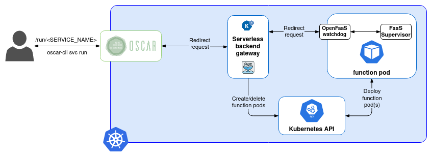

# Invoking services

OSCAR services can be invoked synchronously and asynchronously sending an HTTP POST request to paths `/run/<SERVICE_NAME>` and `/job/<SERVICE_NAME>` respectively. For file processing, OSCAR automatically manages the creation and [notification system](https://docs.min.io/minio/baremetal/monitoring/bucket-notifications/bucket-notifications.html#minio-bucket-notifications) of MinIO buckets in order to allow the event-driven invocation of services using asynchronous requests, generating a Kubernetes job for every file to be processed.

## Service access tokens

As detailed in the [API specification](api.md), invocation paths require the service access token in the request header for authentication. Service access tokens are auto-generated in service creation and update, and MinIO eventing system is automatically configured to use them for event-driven file processing. Tokens can be obtained through the API, using the [`oscar-cli service get`](oscar-cli.md#get) command or directly from the web interface.

## Synchronous invocations

Synchronous invocations allow obtaining the execution output as the response to the HTTP call to the `/run/<SERVICE_NAME>` path. For this, OSCAR delegates the execution to a Serverless Backend (currently only [OpenFaaS](https://www.openfaas.com/) is supported, but we plan to integrate [Knative](https://knative.dev) in the near future). Unlike asynchronous invocations that are translated into Kubernetes jobs, synchronous invocations use a "function" pod to handle requests. This is possible thanks to the [OpenFaaS Watchdog](https://github.com/openfaas/of-watchdog), which is injected into each service and is in charge of forking the process to be executed for each request received.

### Input/Output

[FaaS Supervisor](https://github.com/grycap/faas-supervisor), the component in charge of managing the input and output of services, allows JSON or base64 encoded body in service requests. The body of these requests will be automatically decoded into the invocation's input file available from the script through the `$INPUT_FILE_PATH` environment variable.

The output of synchronous invocations will depend on the application itself:

1. If the script generates a file inside the output dir available through the `$TMP_OUTPUT_DIR` environment variable, the result will be the file encoded in base64.
2. If the script generates more than one file inside `$TMP_OUTPUT_DIR`, the result will be a zip archive containing all files encoded in base64.
3. If there are no files in `$TMP_OUTPUT_DIR`, FaaS Supervisor will return its logs, including the stdout of the user script run. **To avoid FaaS Supervisor's logs, you must set the service's `log_level` to `CRITICAL`.**

This way users can adapt OSCAR's services to their own needs.

### OSCAR-CLI

OSCAR-CLI simplifies the execution of services synchronously via the [`oscar-cli service run`](oscar-cli.md#run) command. This command requires the input to be passed as text through the `--text-input` flag or directly a file to be sent by passing its path through the `--input` flag. Both input types are automatically encoded in base64.

It also allow setting the `--output` flag to indicate a path for storing (and decoding if needed) the output body in a file, otherwise the output will be shown in stdout.

An illustration of triggering a service synchronously through OSCAR-CLI can be found in the [cowsay example](https://github.com/grycap/oscar/tree/master/examples/cowsay#oscar-cli).

### cURL

Naturally, OSCAR services can also be invoked via traditional HTTP clients such as [cURL](https://curl.se/) via the path `/run/<SERVICE_NAME>`. However, you must take care to properly format the input to one of the two supported formats (JSON or base64 encoded) and include the [service access token](#service-access-tokens) in the request.

An illustration of triggering a service synchronously through cURL can be found in the [cowsay example](https://github.com/grycap/oscar/tree/master/examples/cowsay#curl).

### Limitations

Using synchronous invocations couldn't be the best way to run long-running resource-demanding applications, like deep learning inference or video processing. This is due to the fact that Kubernetes Serverless Backends do not handle elasticity in the same way as their counterparts in public clouds, such as AWS Lambda. When multiple requests come to OpenFaaS, the function pod itself, with its resource specification (i.e. memory and CPU limits and requests), tries to process them simultaneously, which can cause an overload. Therefore, we consider Kubernetes job generation as the optimal approach to handle event-driven file processing through asynchronous invocations in OSCAR, being the execution of synchronous services a convenient way to support general lightweight container-based applications.

Otherwise, OSCAR allows the configuration of the OpenFaaS Watchdog to limit the number of events to be processed by a function pod simultaneously. This can be done through the `max_inflight` option of the watchdog, which can be configured globally in the OSCAR deployment through the `WATCHDOG_MAX_INFLIGHT` environment variable and the [helm chart parameter](https://github.com/grycap/helm-charts/tree/master/oscar) `openfaas.watchdog.maxInflight`.
