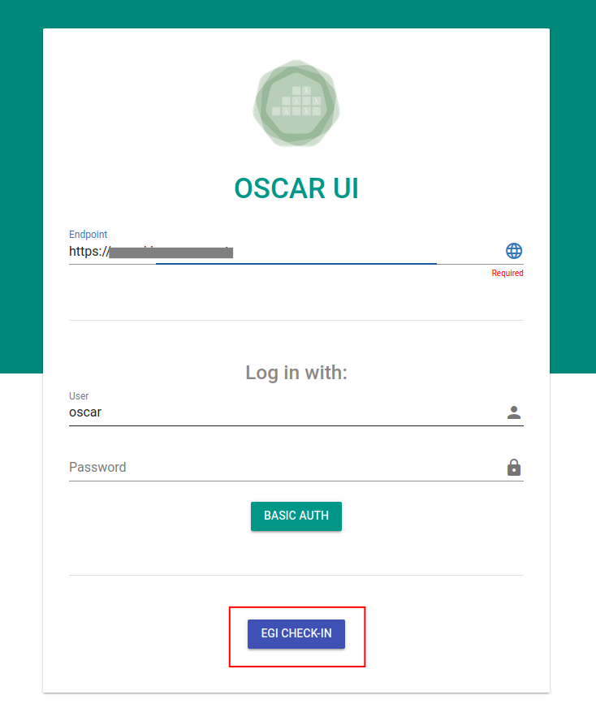

# OpenID Connect Authorization

OSCAR REST API supports OIDC (OpenID Connect) access tokens to authorize users since release `v2.5.0`. By default, OSCAR clusters deployed via the [IM Dashboard](deploy-im-dashboard.md) are configured to allow authorization via basic auth and OIDC tokens using the [EGI Check-in](https://www.egi.eu/service/check-in/) issuer. From the IM Dashboard deployment window, users can add one [EGI Virtual Organization](https://operations-portal.egi.eu/vo/a/list) to grant access for all users from that VO.

## Accessing from OSCAR-UI

The static web interface of OSCAR has been integrated with EGI Check-in and published in [ui.oscar.grycap.net](https://ui.oscar.grycap.net) to facilitate the authorization of users. To login through EGI Checkín using OIDC tokens, users only have to put the endpoint of its OSCAR cluster and click on the "EGI CHECK-IN" button.

## Integration with OSCAR-CLI via OIDC Agent

Since version `v1.4.0` [OSCAR-CLI](oscar-cli.md) supports API authorization via OIDC tokens thanks to the integration with [oidc-agent](https://indigo-dc.gitbook.io/oidc-agent/).

Users must install the oidc-agent following its [instructions](https://indigo-dc.gitbook.io/oidc-agent/installation) and create a new account configuration for the `https://aai.egi.eu/auth/realms/egi/` issuer. After that, clusters can be added with the command [`oscar-cli cluster add`](oscar-cli.md#add) specifying the oidc-agent account name with the `--oidc-account-name` flag.