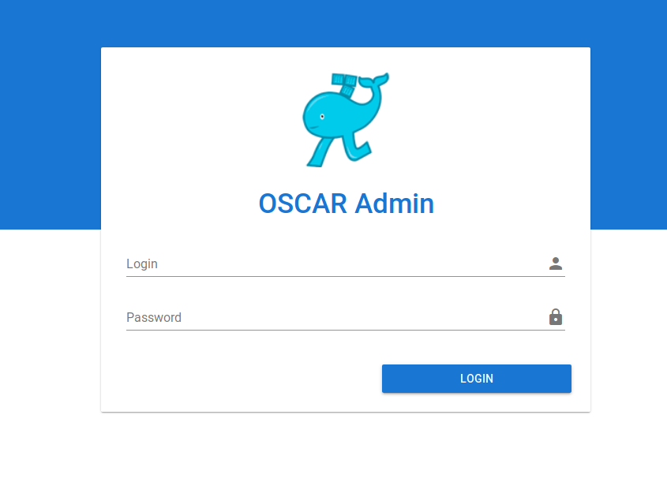
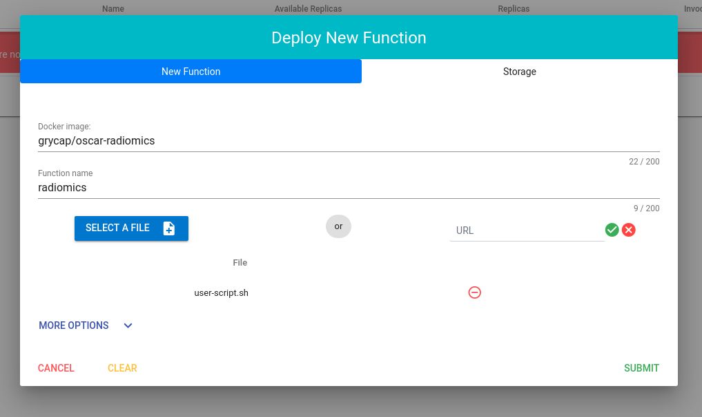
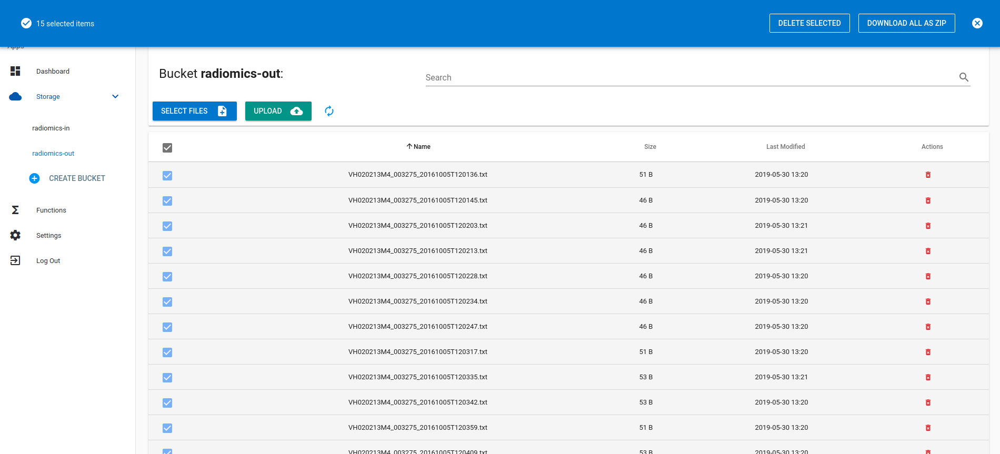
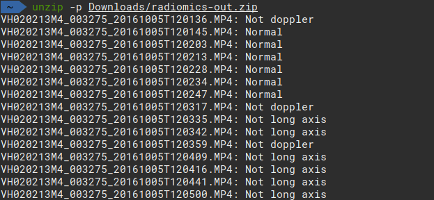
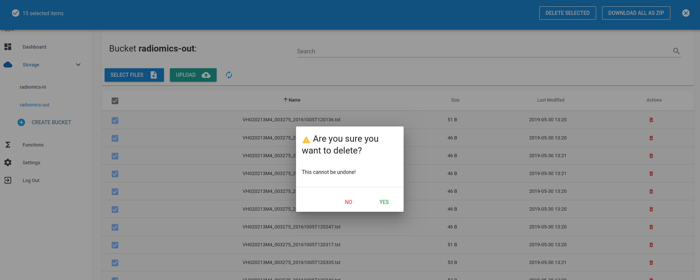
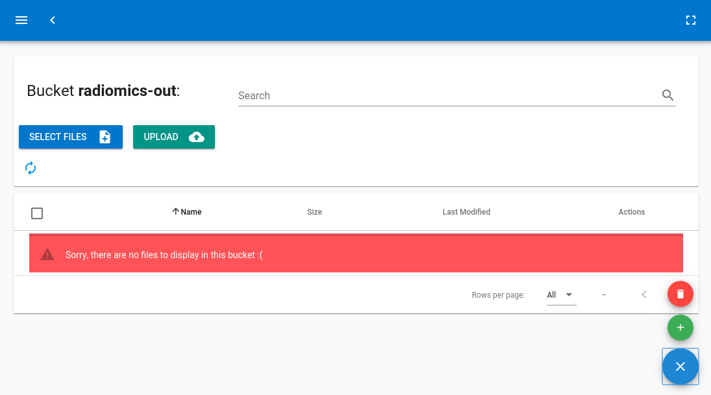

# Radiomics with Keras and TF

Use-case about the handling of Rheumatic Heart Disease (RHD) through image
computing and Artificial Intelligence (AI).

Example from the [ATMOSPHERE Project](https://www.atmosphere-eubrazil.eu/).
Cloned from: <https://github.com/eubr-atmosphere/radiomics>

This application focuses on the implementation of the pilot application on
Medical Imaging Biomarkers. This radiomics approach includes a processing
pipeline to extract frames from videos, classify them, select those frames
with significative data, filter them and extract image features using first-
and second-order texture analysis and image computing. Finally, that pipeline
concludes a classification (normal, definite or borderline RHD).

## STEP 1: Deploy the OSCAR cluster on an IaaS Cloud

Follow the [deployment instructions](https://o-scar.readthedocs.io/en/latest/deploy.html).

## STEP 2: Log in the OSCAR UI

Log in into the OSCAR UI using the
[Default Service Endpoints](https://o-scar.readthedocs.io/en/latest/usage.html#default-service-endpoints)
and access credentials.



## STEP 3: Create the Function

You will use the following information:

* Docker image: [grycap/oscar-radiomics](https://hub.docker.com/r/grycap/oscar-radiomics)
* Script: The `user-script.sh` file in this directory in charge of processing
    the image.

Create a new function and specify the aforementioned details:



You can also specify additional options like environment variables or, like
in this case, memory and cpu limits.


Press the Submit button and you will receive a confirmation message.

## STEP 4: Verify the Created Buckets and Function

After a few seconds the function will be created:


and the input and output buckets will be automatically created as well:


## STEP 5: Upload Video Files to Trigger the Function

Upload videos to the input bucket created. You have to select the video first
and then upload it. You can upload a bunch of videos at the same time.


## STEP 6: Download results

The processed file will be automatically uploaded to the output bucket. When
the execution is finished you can download all the generated files as a zip.
First you have to select all the generated files by clicking in
'*Rows per page: All*' and then you can select all the files by clicking on
the checkbox of the header row and then clicking in the button
*DOWNLOAD ALL AS A ZIP* like in the following image:



Now you can visualize the result of each video opening the *.txt* output file.
Moreover, you can print all the results downloaded as a zip file using the
`unzip` tool:



## STEP 7: Remove the Function

Once you have finished you can delete the function:


And in case you want to remove the buckets as well you can proceed as follows.

First delete all the files:



Then, delete the bucket:



## STEP 8: Terminate the OSCAR Cluster

You can terminate the Kubernetes cluster with the
[EC3](https://github.com/grycap/ec3) command:

```sh
ec3 destroy <cluster-name>
```
